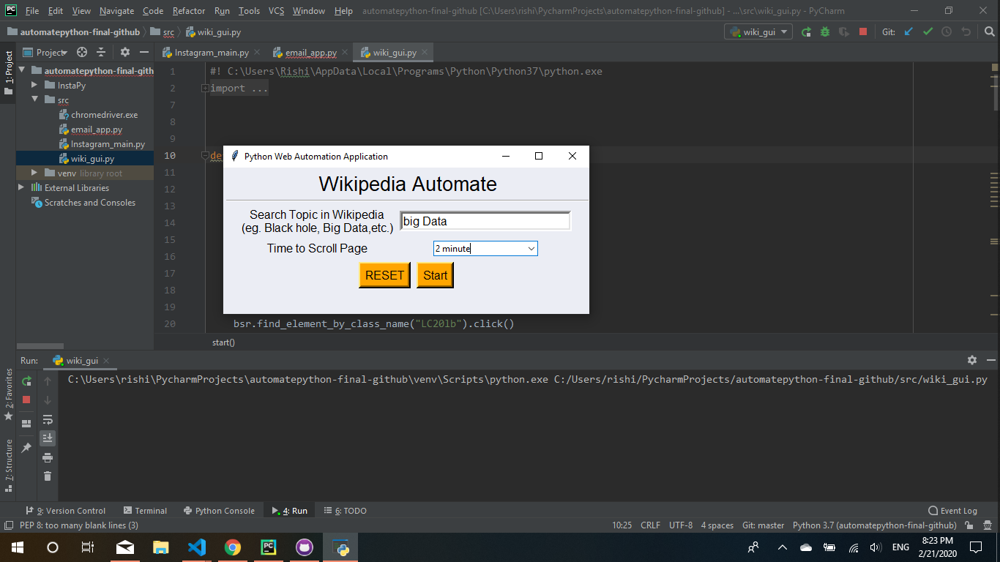
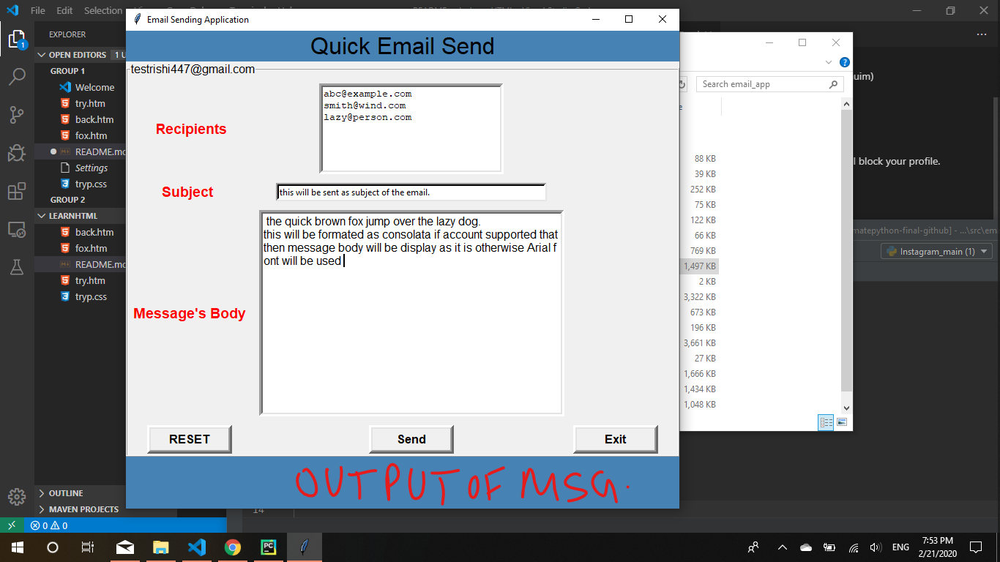
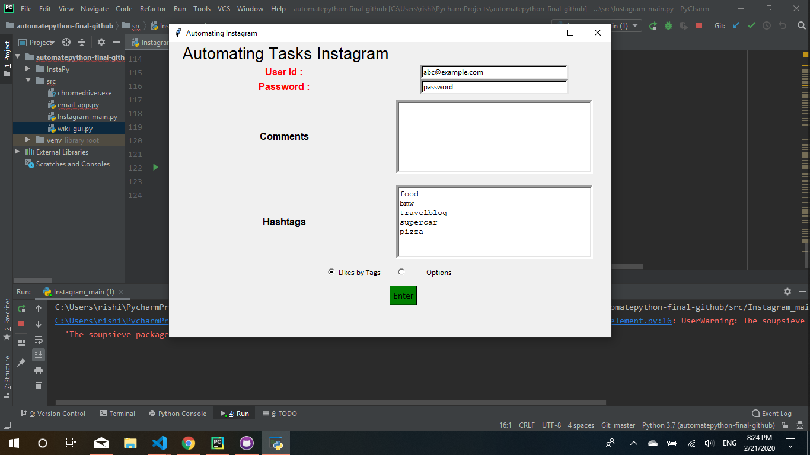

# Automate Through Python
Three GUI based Desktop Application made on python.
--
1. Wikipedia Auto downloader (by using Selenuim)
1. Quick Email Sending Application 
1. Instragram Bot Application

Some other automate scripts are also there. 
* facebook (use with own risk as facebook will block your profile. don't use your main profile with it.)
* google news - it's simple selenium scripts just made for learning selenium and python
### Requirements
> Selenium, Python3, InstaPy, mime

Other Requirement mentioned in requirement.txt file

#### Wikipedia Application
enter the topic of your want and press the start button it start the automate process with your browser which has driver installed and path mentioned in it.

also it will be smooth scroll based on the timer - it will depend of user time tack to read a page

#### Quick Email Send Application
this is Application which will be sent multiple email to the Receipients with the formatted message body and Subject

#### InstaGram Automate Application

This  Application took me more time than the Application which i made Earlier

It was very simple functionality but more dynamic in nature than other above two Application.

You just have to enter your Intagram user id and Password and then enter the hashtags of your choice (e.g - food, bmw, travelblog, supercars etc) 

there is default Comments with emoji already i written in the instragram-main.py file 
but if you want to enter your own comments than enter into the comments text entry box otherwise default Comment will be used.

